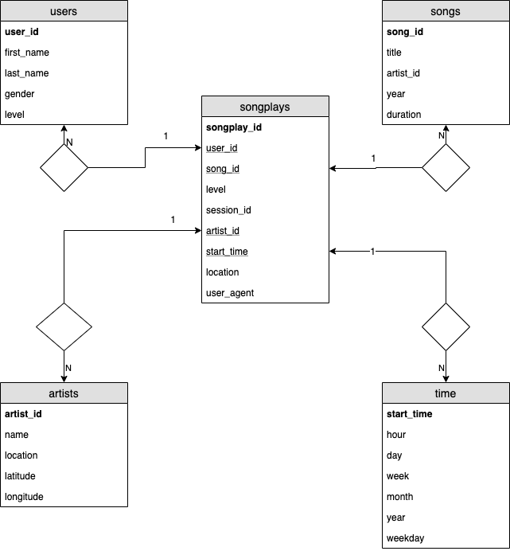

# Project: Data Modeling with Postgres

## Summary

This project creates a data mart (star schema) in PostgreSQL for analytics. The input data is given by json files stored at 
```/data``` folder and a ETL process reads those files to load the data into a PostgreSQL database.

This schema has a fact table:
* ```songplays```

And the following dimension tables:
* ```users```
* ```songs```
* ```artists```
* ```time```



## File description

In this section the input data structure is described.

### Song data files

The data files about songs are stored at ```data/song_data``` folder. Each file is a collection of songs splitted in json objects. Example:

```json
{
    "num_songs": 1,
    "artist_id": "ARD7TVE1187B99BFB1",
    "artist_latitude": null,
    "artist_longitude": null,
    "artist_location": "California - LA",
    "artist_name": "Casual",
    "song_id": "SOMZWCG12A8C13C480",
    "title": "I Didn't Mean To",
    "duration": 218.93179,
    "year": 0
}
```

### Log data files

This is an example of a log file. This file is generated when a user plays a song in the music application.

```json
{
    "artist":"Sydney Youngblood",
    "auth":"Logged In",
    "firstName":"Jacob",
    "gender":"M",
    "itemInSession":53,
    "lastName":"Klein",
    "length":238.07955,
    "level":"paid",
    "location":"Tampa-St. Petersburg-Clearwater, FL",
    "method":"PUT",
    "page":"NextSong",
    "registration":1540558108796.0,
    "sessionId":954,
    "song":"Ain't No Sunshine",
    "status":200,
    "ts":1543449657796,
    "userAgent":"\"Mozilla\/5.0 (Macintosh; Intel Mac OS X 10_9_4) AppleWebKit\/537.78.2 (KHTML, like Gecko) Version\/7.0.6 Safari\/537.78.2\"",
    "userId":"73"
}
```

## Run the project

First, we have to create the tables. There is a python script called ```create_tables.py``` that executes all queries in ```sql_queries.py```. Execute the following command:
```
python create_tables.py
```

Then, there is another python script ```etl.py``` that reads all files from ```data/log_data``` and ```data/song_data``` folders and insert into the proper table.
```
python etl.py
```

## Output

### Artists table


### Songs table


### Users table


### Time table


### Songplays table

