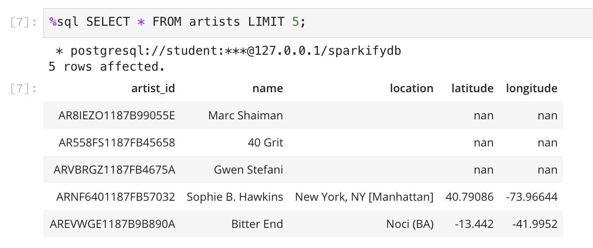
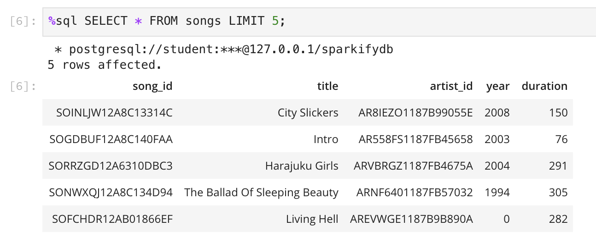
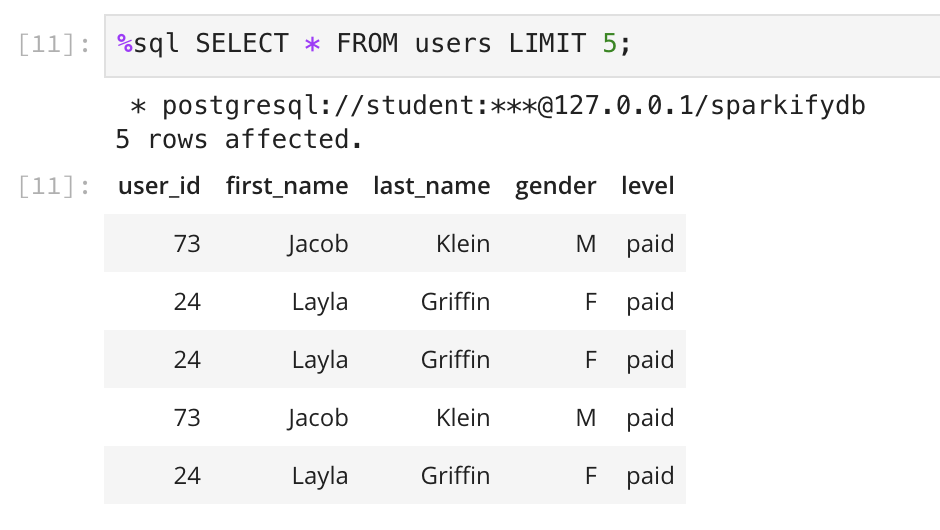
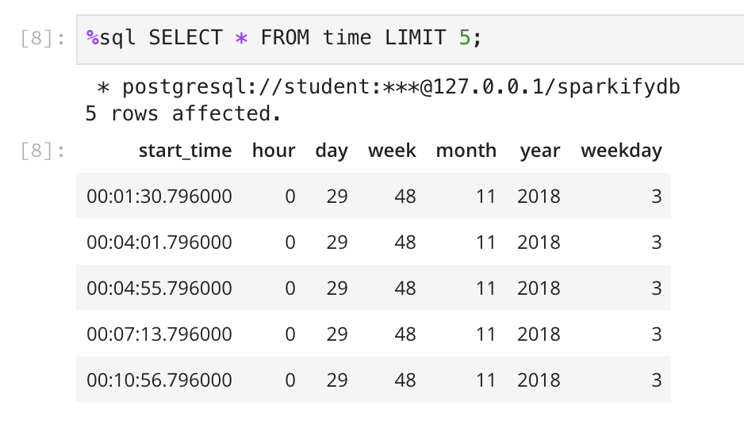
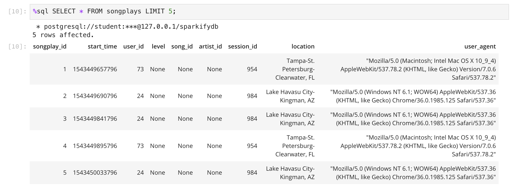

# Project: Data Modeling with Postgres

## Summary
This project creates a relational database in PosgreSQL reading json files from ```/data``` folder and insert the data into the following tables:

* ```songplays```
* ```users```
* ```songs```
* ```artists```
* ```time```

## File Description

## Run the project

First, tables have to be created executing the next command:
```
python create_tables.py
```

Then, ETL must be executed to read the files and insert the date into the tables:
```
python etl.py
```

## Output

### Artists table



### Songs table



### Users table



### Time table



### Songplays table

